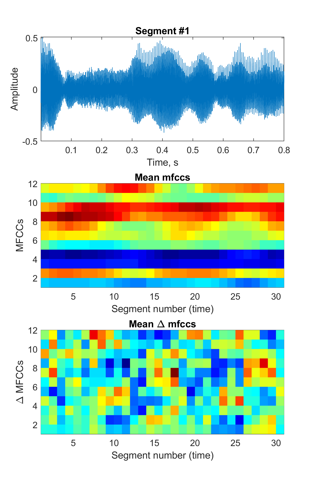

# Troparion
Matlab tools for pathological voice analysis. Currently the toolset is under development. 

## What can be calculated using **Troparion**?
* Jitter::local
* Jitter::RAP
* Jitter::PPQ5
* Jitter::PPQ55
* Shimmer::local
* Shimmer::APQ3
* Shimmer::APQ5
* Shimmer::APQ11
* Shimmer::APQ55
* DPF – directional perturbation factor
* PFR – phonatory frequency range
* PPE - pitch period entropy (based on the work of [Max A. Little](<https://ieeexplore.ieee.org/document/4636708>))
* PVI - pathological vibrato index (original feature for [ALS detection](<https://www.bsuir.by/m/12_100229_1_139167.pdf>))
* Suprasegmental MFCCs.

An example of calculation of perturbation features can be found in ```feature_extraction_example.m```.

## Suprasegmantal MFCC
An example of calculation of suprasegmantal MFCC can be found in ```mfcc_example.m```.
The result of analysis is given below.



## Database for SPA 2019 conference paper
The repository contains folder https://github.com/Mak-Sim/Troparion/tree/master/SPA2019 with database and supplementary information to paper _M. Vashkevich, Yu. Rushkevich, A. Petrovsky "Bulbar ALS Detection Based on Analysis of Voice Perturbation and Vibrato," Proceedings of inter. conf. Signal Processing: Algorithms, Architectures, Arrangements, and Applications (SPA), Poznan, Poland, 18-20 Sept. 2019. – P. 267-272._
