# Bulbar ALS Detection Based on Analysis of Voice Perturbation and Vibrato
Voice database and supplementary information to paper 

_M. Vashkevich, Yu. Rushkevich, A. Petrovsky ["Bulbar ALS Detection Based on Analysis of Voice Perturbation and Vibrato,"](https://www.bsuir.by/m/12_100229_1_139167.pdf) Proceedings of inter. conf. Signal Processing: Algorithms, Architectures, Arrangements, and Applications (SPA), Poznan, Poland, 18-20 Sept. 2019. – P. 267-272._

## Abstract
The purpose of the work was to verify the sutability of the sustain vowel phonation test for automatic detection of patients with ALS (amyotrophic lateral sclerosis). Enhanced procedure for separation of voice signal into fundamental periods that requires for calculation of perturbation measurements (such as jitter and shimmer) is proposed. The second contribution: the method for quantitative assessment of pathological vibrato manifestations in sustain vowel phonation. The study’s experiments
show that using the proposed acoustic analysis methods, the classifier based on linear discriminant analysis attains 90.7% accuracy with 86.7% sensitivity and 92.2% specificity.

##  Database
The voice data used in this study was collected in Republican Research and Clinical Center of Neurology and Neurosurgery (Minsk, Belarus). A total of **54 speakers** were
recorded, with **39 healthy speakers** (23 males, 16 females) and **15 ALS patients** with signs of bulbar dysfunction (6 males, 9 females). The average age in the healthy group was 41.9 years (SD 16.3, Min 18, Max 82) and the average age in the ALS group was 57.7 years (SD 9.0, Min 40, Max 70). All the participants were asked to produce the sustained vowel /a/ at a comfortable pitch and loudness as constant and long as
possible. The phonation was performed on one breath. The voice signals were recorded using smartphone with a headset (sample rate 44.1 kHz) and stored as 16 bit uncompressed PCM files. The records were manually edited to remove the
beginning and ending of each utterance, removing the onset and offset effects in these parts of each utterance. Average duration of the samples is 4.1 s.

Given that mean age for healthy group was about 17 years younger than ALS patients, we applied linear regression technique to remove age effect using the data of the healthy
group. The correction was applied to the data of healthy speakers and ALS patients.

## Acoustical features
The folowing acoustical features were extracted:

- Jitter::local
- Jitter::RAP
- Jitter::PPQ
- Shimmer::local
- Shimmer::APQ3
- Shimmer::APQ5
- Shimmer::APQ11
- Pathology vibrato index (PVI) 

## Voices parameters
In order to visualize the parameters of voice in HC and ALS groups we calculate statistics for the features used in the study.

| Raw data   | Age corrected |
| :--:       | :--:          |
|Jitter::loc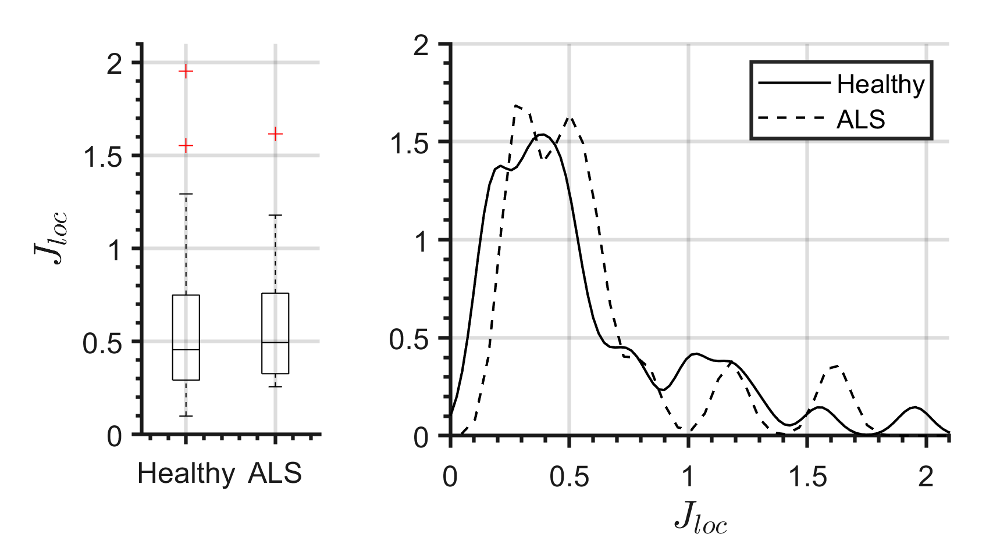 | Jitter::loc|
|Jitter::RAP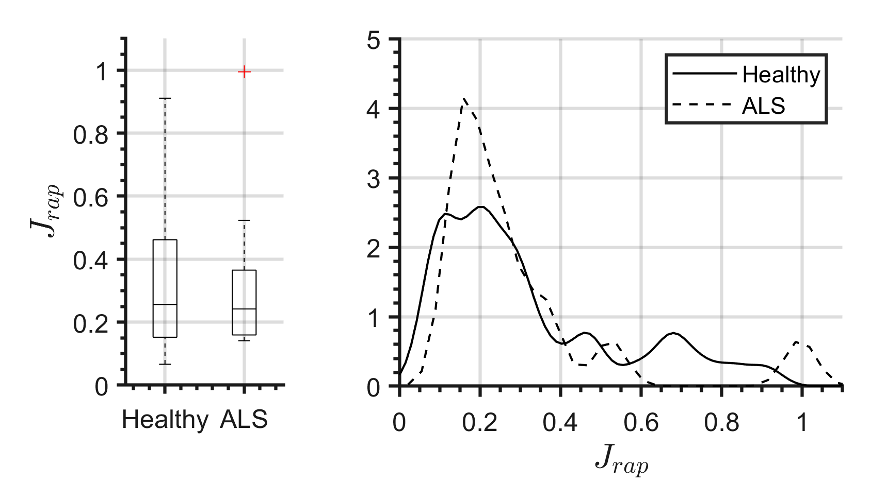 | Jitter::RAP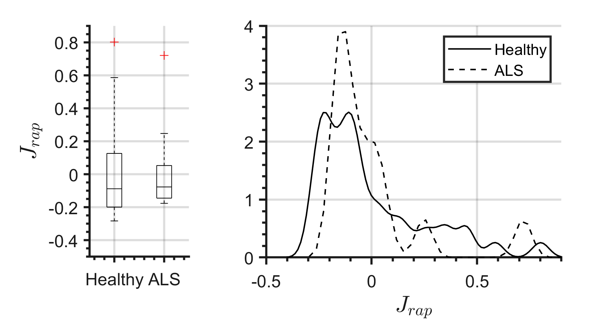|
|Jitter::PPQ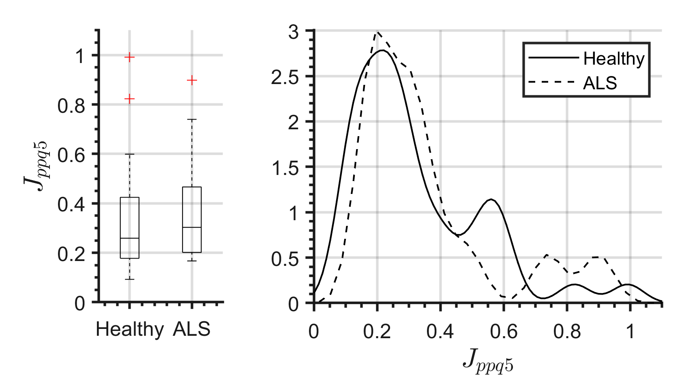 | Jitter::PPQ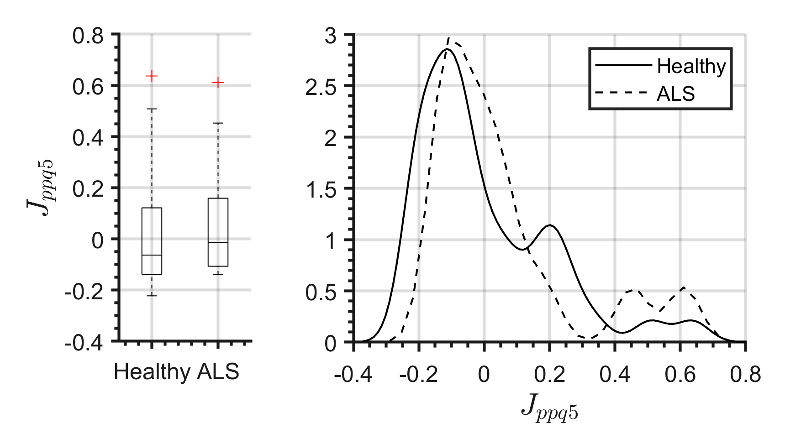|
|Shimmer::loc | Shimmer::loc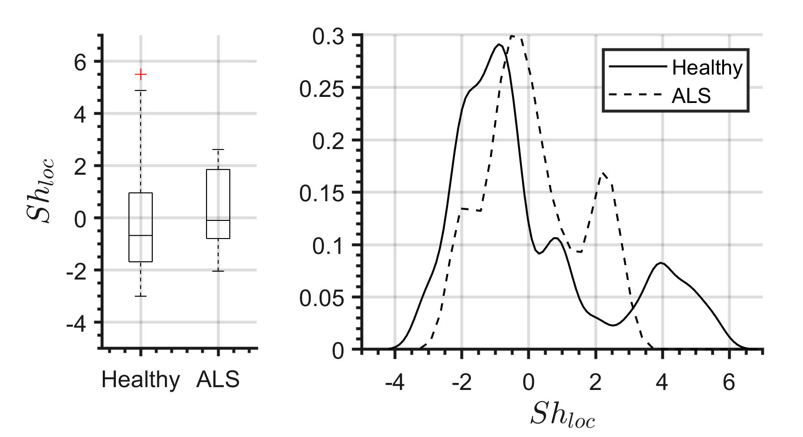|
|Shimmer::APQ3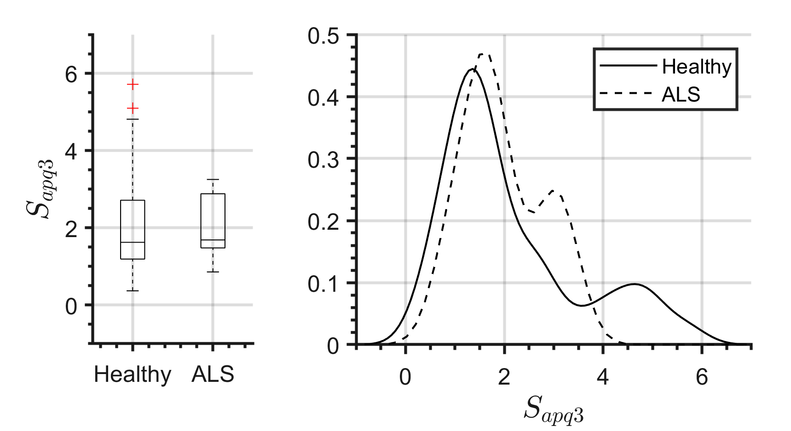 | Shimmer::APQ3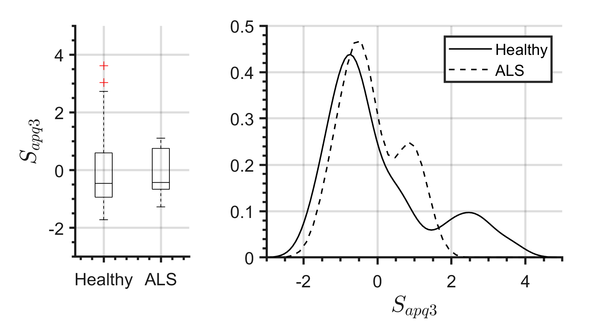|
|Shimmer::APQ5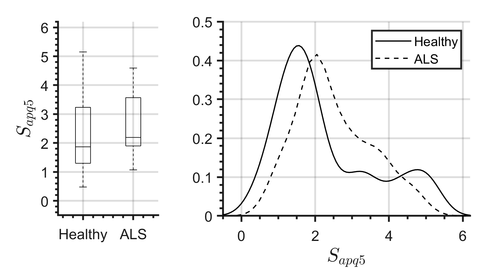 | Shimmer::APQ5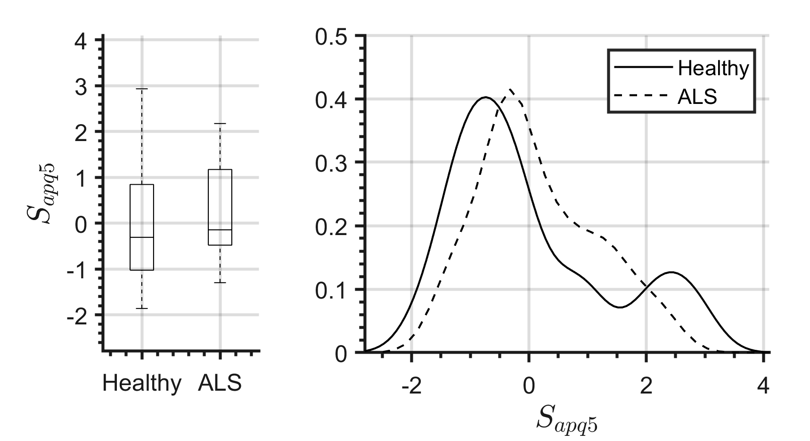|
|Shimmer::APQ11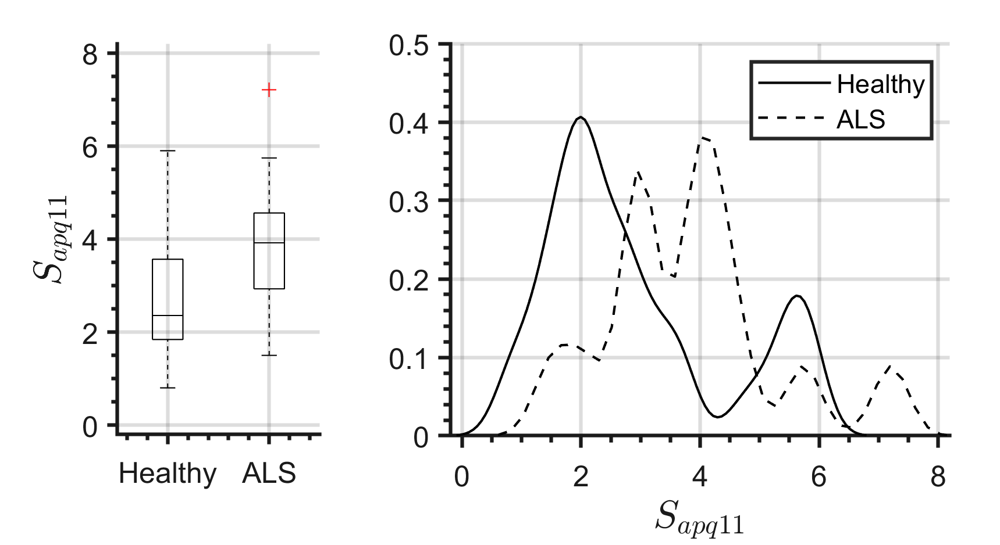 | Shimmer::APQ11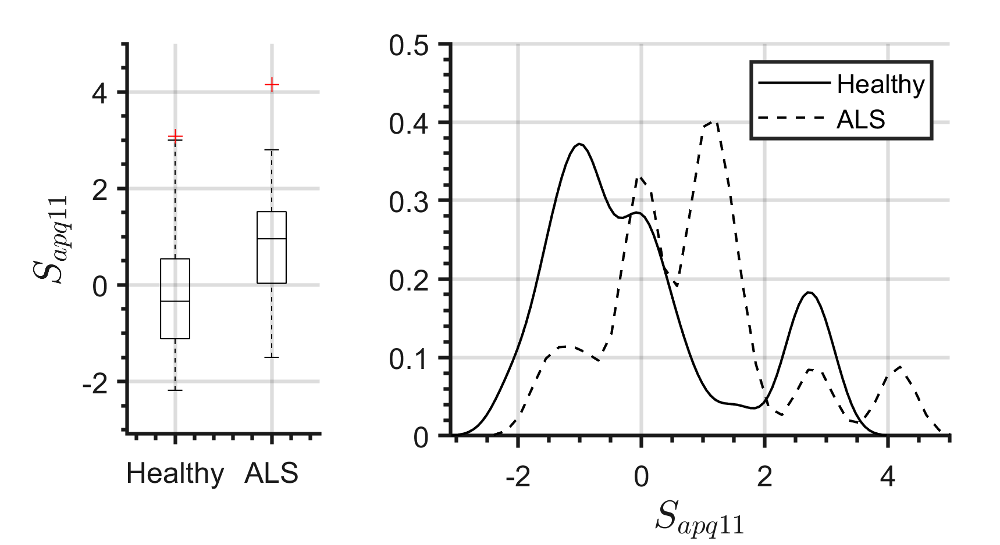|
|PVI | PVI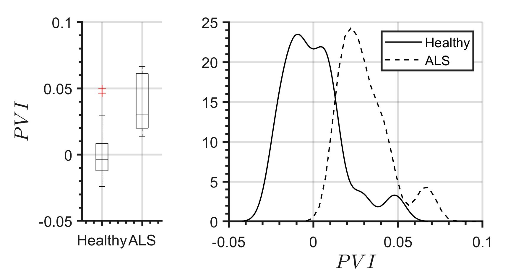|

## Classification
For binary classification task of discriminating between the two classes of normal and pathological cases two machine-learning approaches were used:
- Linear Discriminant Analysis (LDA); 
- k-Nearest Neighbors (k-NN).

## Classification results
We performed ALS classification of voice samples using following three feature sets: 
1) shimmers/jitters extracted using PRAAT; 
2) shimmers/jitters extracted using the waveform matching method with phase contrained (WM with PC); 
3) the same as in previous case but with PVI (Pathology Vibrato Index).

The dimensionality _D_ of the  feature sets was low (_D_=7 for 1st and 2nd and _D_=8 for 3rd) therefore we have performed exhaustive search through all possible feature subset to find the best one.

*Table - LDA-based classification*

| Features   | Averaved Recall  |  Accuracy | Sensitivity | Specificity |
| :--------: | :--------------: | :-------: | :---------: | :---------: | 
|  |  |  | _PRAAT features_ | |
| [S:apq5 S:apq11] | 83.1% | 81.1+/-1.9  | 83.0+/-5.6  | 83.1+/-1.4 |
|  |  |  | _Features based on WM with PC_ | |
| [J:loc J:ppq S:apq3 S:apq11] | 86.0% | 86.4+/-2.3  | 85.0+/-3.3  | 87.0+/-2.6 |
|  |  |  | _Features based on WM with PC + PVI_ | |
| [S:loc S:apq3 S:apq11 PVI] | **89.5%** | 90.7+/-1.7  | **86.7+/-0.1**  | 92.2+/-2.3 |

*Table - kNN-based classification*

| Features   | Averaved Recall  |  Accuracy | Sensitivity | Specificity |
| :--------: | :--------------: | :-------: | :---------: | :---------: | 
|  |  |  | _PRAAT features_ | |
| [J:rap S:loc S:apq3 S:apq11] | 76.0% | 84.6+/-2.2  | 56.8+/-4.8  | 95.3+/-2.1 |
|  |  |  | _Features based on WM with PC_ | |
| [J:loc J:rap J:ppq S:apq5 S:apq11] | 81.0% | 87.3+/-2.1  | 66.8+/-4.9  | 95.1+/-2.2 |
|  |  |  | _Features based on WM with PC + PVI_ | |
| [S:loc S:apq3 S:apq11 PVI] | 86.9% | **91.6+/-2.3**  | 76.3+/-5.8  | **97.5+/-1.7** |

##  Database details
*Table - ALS patients*

| ID   | Age  |  Sex |
| :--: | :--: | :--: |
| 008  | 51   | male |
| 020   | 57   | female |
| 021   | 59   | male |
| 022   | 70   | female |
| 023   | 70   | female |
| 029   | 46   | female |
| 031   | 67   | male |
| 035   | 54   | female |
| 037   | 53   | female |
| 038   | 54   | female |
| 039   | 67   | male |
| 042   | 67   | male |
| 048   | 53   | female |
| 058   | 58   | male |
| 068   | 40   | male |

*Table - Healthy controls*

| ID   | Age  | Sex  |
| :--: | :--: | :--: |
| 002  | 64   | female    |
| 004  | 53   | female    |
| 006  | 41   | male    |
| 010  | 31   | male |
| 012  | 36   | female    |
| 016  | 38   | male |
| 021  | 29   | male |
| 022  | 29   | male |
| 024  | 60   | male |
| 026  | 34   | male |
| 028  | 35   | male |
| 030  | 82   | male |
| 033  | 40   | male |
| 037  | 30   | male |
| 040  | 23   | male |
| 042  | 60   | male |
| 049  | 38   | male |
| 051  | 22   | male |
| 053  | 60   | male |
| 055  | 33   | male |
| 057  | 25   | male |
| 059  | 27   | female    |
| 061  | 37   | female    |
| 063  | 50   | female    |
| 065  | 48   | male |
| 067  | 18   | female    |
| 071  | 19   | male |
| 077   | 40   | female    |
| 079   | 21   | male|
| 081   | 60   | female    |
| 083   | 30   | female    |
| 085   | 55   | female    |
| 086   | 63   | female    |
| 089   | 45   | female |
| 095   | 28   | female |
| 097   | 39   | female|
| 099   | 57   | female |
| 107  | 80   | male |
| 109  | 57   | female |

